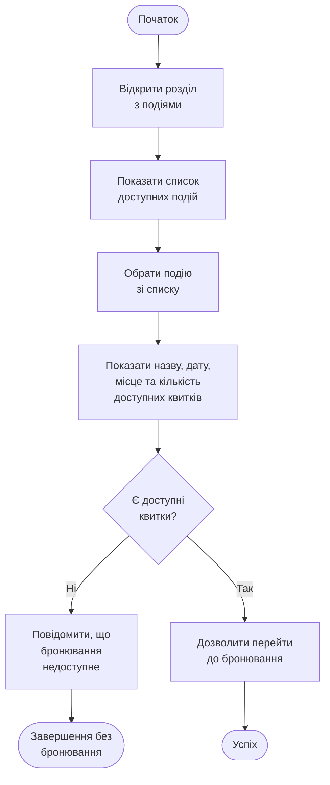

## UC-01 «Переглянути події»

```mermaid
%%{init: {"themeVariables": {"fontFamily": "Arial, Helvetica, sans-serif"}, "flowchart": {"padding": 20}}}%%
flowchart TD
    A(["Початок"]) --> B["Відкрити розділ<br/>з подіями"]
    B --> C["Показати список<br/>доступних подій"]
    C --> D["Обрати подію<br/>зі списку"]
    D --> E["Показати назву, дату,<br/>місце та кількість<br/>доступних квитків"]
    E --> F{"Є доступні<br/>квитки?"}
    F -->|Ні| G["Повідомити, що<br/>бронювання<br/>недоступне"]
    G --> H(["Завершення без<br/>бронювання"])
    F -->|Так| I["Дозволити перейти<br/>до бронювання"]
    I --> J(["Успіх"])
```