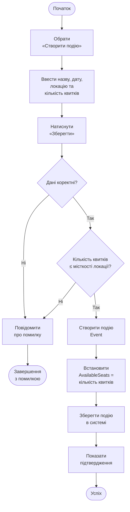

## UC-02 «Створити подію»

```mermaid
%%{init: {"themeVariables": {"fontFamily": "Arial, Helvetica, sans-serif"}, "flowchart": {"padding": 20}}}%%
flowchart TD
    A(["Початок"]) --> B["Обрати<br/>«Створити подію»"]
    B --> C["Ввести назву, дату,<br/>локацію та<br/>кількість квитків"]
    C --> D["Натиснути<br/>«Зберегти»"]
    D --> E{"Дані коректні?"}
    E -->|Ні| J["Повідомити<br/>про помилку"]
    E -->|Так| F{"Кількість квитків<br/>≤ місткості локації?"}
    F -->|Ні| J
    F -->|Так| G["Створити подію<br/>Event"]
    G --> H["Встановити<br/>AvailableSeats =<br/>кількість квитків"]
    H --> I["Зберегти подію<br/>в системі"]
    I --> K["Показати<br/>підтвердження"]
    K --> L(["Успіх"])
    J --> M(["Завершення<br/>з помилкою"])
```