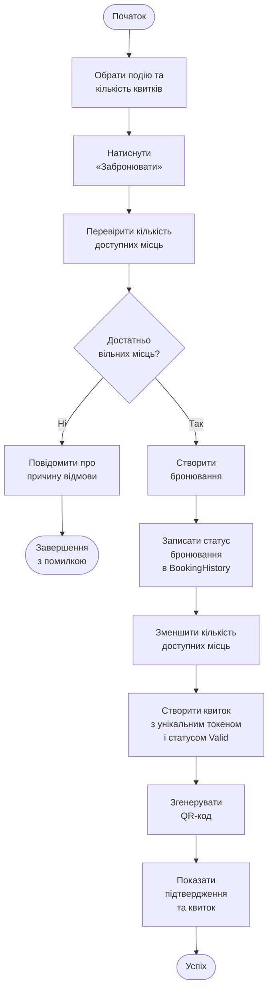

## UC-03 «Забронювати квиток»

```mermaid
%%{init: {"themeVariables": {"fontFamily": "Arial, Helvetica, sans-serif"}, "flowchart": {"padding": 20}}}%%
flowchart TD
    A(["Початок"]) --> B["Обрати подію та<br/>кількість квитків"]
    B --> C["Натиснути<br/>«Забронювати»"]
    C --> D["Перевірити кількість<br/>доступних місць"]
    D --> E{"Достатньо<br/>вільних місць?"}
    E -->|Ні| F["Повідомити про<br/>причину відмови"]
    F --> G(["Завершення<br/>з помилкою"])
    E -->|Так| H["Створити<br/>бронювання"]
    H --> I["Записати статус<br/>бронювання<br/>в BookingHistory"]
    I --> J["Зменшити кількість<br/>доступних місць"]
    J --> K["Створити квиток<br/>з унікальним токеном<br/>і статусом Valid"]
    K --> L["Згенерувати<br/>QR-код"]
    L --> M["Показати<br/>підтвердження<br/>та квиток"]
    M --> N(["Успіх"])
```