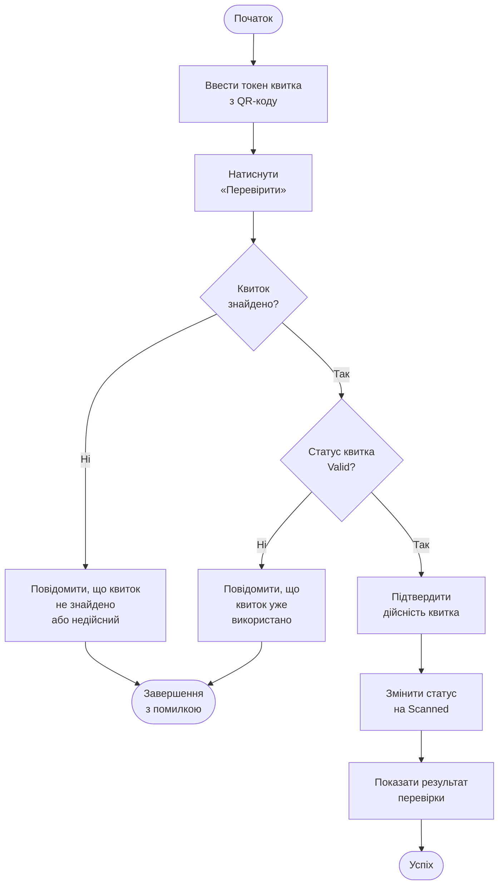

## UC-04 «Перевірити квиток»

```mermaid
%%{init: {"themeVariables": {"fontFamily": "Arial, Helvetica, sans-serif"}, "flowchart": {"padding": 20}}}%%
flowchart TD
    A(["Початок"]) --> B["Ввести токен квитка<br/>з QR-коду"]
    B --> C["Натиснути<br/>«Перевірити»"]
    C --> D{"Квиток<br/>знайдено?"}
    D -->|Ні| E["Повідомити, що квиток<br/>не знайдено<br/>або недійсний"]
    E --> F(["Завершення<br/>з помилкою"])
    D -->|Так| G{"Статус квитка<br/>Valid?"}
    G -->|Ні| H["Повідомити, що<br/>квиток уже<br/>використано"]
    H --> F
    G -->|Так| I["Підтвердити<br/>дійсність квитка"]
    I --> J["Змінити статус<br/>на Scanned"]
    J --> K["Показати результат<br/>перевірки"]
    K --> L(["Успіх"])
```